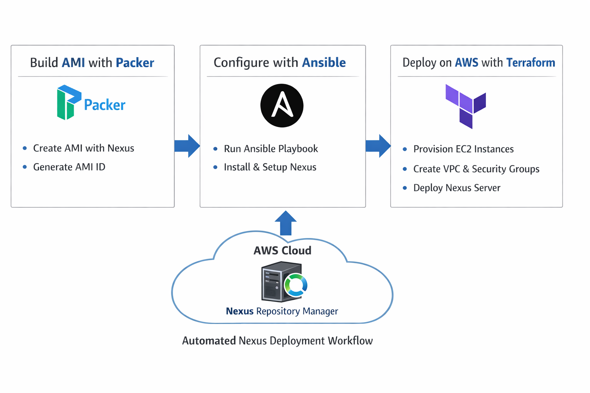

# Nexus Deployment on AWS

This repository demonstrates an automated deployment of **Sonatype Nexus Repository Manager** on AWS using **Ansible, Packer, and Terraform**.

The project builds a custom AMI with Nexus installed and deploys it using Terraform infrastructure.

---

# Project Architecture

The deployment workflow follows these steps:

1. **Ansible** installs Nexus on a temporary EC2 instance.
2. **Packer** creates a reusable AMI with Nexus pre-installed.
3. **Terraform** provisions infrastructure and launches an EC2 instance from the AMI.
4. **Terraform modules** organize infrastructure code for better reuse.

---

# Workflow Diagram



---

# Repository Structure

nexus-deployment
│
├── NexusProject
│ ├── step2-ansible
│ │ ├── install_nexus.yml
│ │ └── inventory
│ │
│ ├── step3-packer
│ │ └── nexus.pkr.hcl
│ │
│ ├── step4-terraform
│ │ ├── main.tf
│ │ ├── variables.tf
│ │ ├── outputs.tf
│ │ └── tfplan
│ │
│ └── step5-module
│ ├── nexus-instance
│ │ ├── main.tf
│ │ └── variables.tf
│ └── outputs.tf
│
├── terraform-nexus-workflow
│ ├── main.tf
│ └── step5-module
│ ├── main.tf
│ ├── variables.tf
│ ├── modules
│ │ └── nexus-server
│ │ ├── main.tf
│ │ ├── variables.tf
│ │ └── outputs.tf
│ └── nexus-server
│ ├── main.tf
│ ├── variables.tf
│ └── outputs.tf
│
└── docs
└── nexus-workflow.png


---

# Prerequisites

Before running this project make sure you have:

- AWS Account
- AWS CLI configured
- Terraform installed
- Packer installed
- Ansible installed
- SSH key pair for EC2

---

# Deployment Steps

## Step 1: Clone Repository

```bash
git clone https://github.com/bayanur5/nexus-deployment.git
cd nexus-deployment

cd NexusProject/step2-ansible
ansible-playbook -i inventory install_nexus.yml

cd ../step3-packer
packer build nexus.pkr.hcl

cd ../../terraform-nexus-workflow
terraform init
terraform plan
terraform apply

http://<EC2_PUBLIC_IP>:8081

/opt/sonatype-work/nexus3/admin.password

Author

GitHub: https://github.com/bayanur5

Technologies Used

AWS EC2

Terraform

Packer

Ansible

Nexus Repository Manager


---

4️⃣ After pasting:

Press **`Esc`**

Type:


Press **Enter**

---

5️⃣ Then run:

```bash
git add README.md
git commit -m "Add project README"
git push origin main
